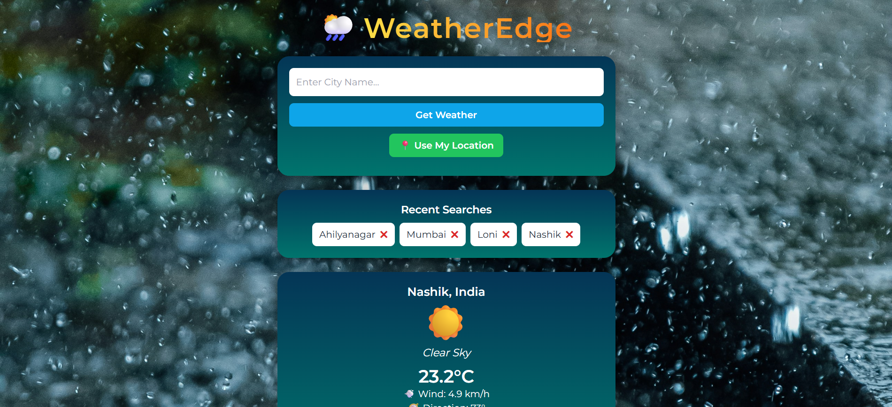

🌦️ WeatherEdge – Advanced Weather Forecast Web App

A fully responsive web-based weather application that allows users to search any location and instantly view real-time weather insights such as:
✔ Temperature
✔ Weather Condition
✔ Air Quality Index (AQI)
✔ Wind Speed
✔ 5-Day Weather Forecast
✔ Search Suggestions
✔ Location-based Weather (GPS)
✔ Search History (with remove option)
✔ Forecast Chart (visual trend)

🚀 Live Features

Feature	Description
🔍 Search weather by city / location	
🌡️ Temperature in °C	
☁️ Weather condition & icon	
📅 5-Day forecast with chart	
💨 Wind speed (km/h)	
🧪 Air Quality Index (AQI)	
📍 GPS-based auto-location	
🧠 Search suggestions (auto complete)	
🧾 Recent searches (removable)	
🎨 Gradient UI + Montserrat Font	

🛠️ Tech Stack

Technology	Purpose
HTML	App structure
Tailwind CSS	Styling & layout
JavaScript	Logic & API handling
Open-Meteo API	Real-time weather data (No API key required)
Google Fonts API	UI typography (Montserrat)
Chart.js	Forecast temperature graph

📦 Installation & Setup
🔻 Clone the Repository
git clone https://github.com/pratikrokade1016/weather-app.git
cd weather-app

▶️ Run the App

Simply open the HTML file in your browser:
➡ Right-click → Open With → Browser
or
➡ Drag and drop into Chrome / Edge

Weather App.html

📸 Screenshots
WebApp Preview

📡 API Integration
🔹 Google Font API (already included)
<link href="https://fonts.googleapis.com/css2?family=Montserrat:wght@400;600&display=swap" rel="stylesheet">

🔹 Weather API Used

✔ No key required
✔ Uses Open-Meteo API (Fast & Free)
✔ Automatically fetches latitude & longitude

const geoAPI = "https://geocoding-api.open-meteo.com/v1/search?name=";
const weatherAPI = "https://api.open-meteo.com/v1/forecast";

📌 Future Enhancements

✔ 📱 Convert to Mobile App (Flutter / React Native)
✔ 🎙 Voice Search Integration
✔ 🌧 Weather Animations (Rain, Clouds, Snow)
✔ 🧭 Wind Direction Compass (UI)
✔ 📊 Air Quality Graph
✔ 🌍 Multi-language Support

👨‍💻 Author

👤 Pratik Rokade
📌 GitHub: pratikrokade1016

📧 Feel free to contribute or suggest improvements!

⭐ If you like this project, don't forget to give it a star on GitHub!
⭐ Star this repository — it motivates development!
